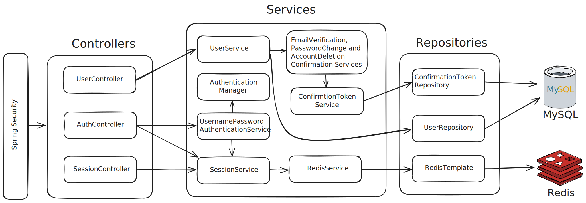

# Session Secure App

Session Secure App is an application that demonstrates the use of user
authentication and authorization with roles.

## Technologies Used

### Core Technologies

- **Java**: Primary programming language
- **Spring Boot**: Framework for creating standalone, production-grade
  Spring-based applications
- **Spring Security**: Authentication and access-control framework
- **Spring Session**: Provides an API and implementations for managing user
  session information
- **JavaMailSender**: For sending emails

### Database

- **MySQL**: Open-source relational database management system (RDBMS)
- **Hibernate/JPA**: Object-relational mapping and database interaction
- **Redis**: In-memory data structure store, used as a database, cache, and
  message broker. In this case is used to store sessions

The application consists of a frontend and a backend. This project is the
backend repository, and you can find the frontend
repository [here](https://github.com/aboher/session_secure_app_frontend "Session Secure App Frontend").

Both frontend and backend are deployed and working together. Here are the links
to each:

- [Frontend](https://session-secure-app-frontend.pages.dev/)
- [Backend](https://vps-4547216-x.dattaweb.com)

You can test the system by creating a user. You'll need an email address that
will be verified to activate your account. If you don't want to use your
personal email, a [Temporary Email](https://temp-mail.org/) can be used.
Alternatively, you can use the default users I've created to test the
application:

| User               | Password  | Role      |
|--------------------|-----------|-----------|
| user@mail.com      | user      | USER      |
| moderator@mail.com | moderator | MODERATOR |
| admin@mail.com     | admin     | ADMIN     |

You can log in from different browsers with different accounts to test each
role.

Here is a breakdown of what each role can do:

| Role      | Actions                                                        |
|-----------|----------------------------------------------------------------|
| USER      | View and invalidate their own active sessions                  |
| MODERATOR | Perform user-level actions and manage session attributes       |
| ADMIN     | Perform moderator-level actions and manage all users' sessions |

In addition to these functionalities, you can also reset your password by
navigating to
the [Sign-In Page](https://session-secure-app-frontend.pages.dev/signin) and
clicking the **_I forgot my password_** link.

The application follows best practices for the registration process and password
reset, ensuring that sensitive information—such as whether an account exists—is
only sent via email to the account owner. This approach is detailed in the
following
discussion: [Account registration best practice when an account with the username already exists?](https://www.reddit.com/r/cybersecurity/comments/p37vnk/account_registration_best_practice_when_an/)

> The guidance for forgot your password changed from saying "An account with
> this email address was not found" to "If an account with that email address
> exists, you will receive an email at that address in a few minutes with
> further
> instructions" for this very reason.
>
> In fact,
> [it's an OWASP recommendation](https://cheatsheetseries.owasp.org/cheatsheets/Forgot_Password_Cheat_Sheet.html):
>
> "Return a consistent message for both existent and non-existent accounts"

## Swagger UI Documentation

You can find the complete documentation on the
following [link](https://vps-4547216-x.dattaweb.com/swagger-ui/index.html).

## Diagrams of the Modules Used

To help you understand how the application is structured, here is a simplified
diagram of the most important modules used:



## How to Run the Project Locally

To run the project, you will need Java 21 installed and an IDE to simplify
execution, such as IntelliJ IDEA Community Edition. Additionally, you must have
Docker and Docker Compose installed. I have specified a Docker Compose file so
that you don't need to manually install MySQL or Redis. If you already have
these services installed, ensure there are no port conflicts by stopping the
local services or changing the exposed ports in the Docker Compose file.

There are two Docker Compose files:

- [`docker-compose-dev.yml`](./docker-compose-dev.yml) for local development.
- [`docker-compose-prod.yml`](./docker-compose-prod.yml) for production.

To run the project locally,
use [`docker-compose-dev.yml`](./docker-compose-dev.yml).

### Steps to Run Locally

1. Clone the repository:
    ```bash
    git clone https://github.com/aboher/session_secure_app_backend.git
    ```

2. Navigate to the project directory:
    ```bash
    cd session_secure_app_backend
    ```

3. Create a `.env` file for environment variable configuration:
    ```bash
    touch .env
    ```

4. Copy the content of the `.env.example` file to the newly created `.env` file
   and adjust the values as needed. Below are key details for some environment
   variables:

- **`ENVIRONMENT`**: Set to `dev` for local development, and `prod` for
  production.
- **`DB_URL`**:
  Use `jdbc:mysql://localhost:3306/session_secure_app?serverTimeZone=UTC`.
  Adjust the port if modified in the Docker Compose file.
- **`DB_PASSWORD`**: Sets the MySQL container password, automatically used for
  database connections.
- **`REDIS_HOST`**: Set to `localhost` for local development and production.
- **`REDIS_PASSWORD`**: Sets the Redis container password, automatically used
  for Redis connections.
- **`REDIS_PORT`**: Use `6379`, unless modified in the Docker Compose file.
- **`FRONTEND_URL`**: Use `http://localhost:5173` for local development to allow
  backend-to-frontend communication.

SMTP server settings are also required for email functionality. Gmail's SMTP
server can be used for testing by generating an app password in your Gmail
account. For reference, see section 3
of [this article](https://deeppatel23.medium.com/user-registration-with-email-verification-in-java-and-spring-boot-699cb832ad2c).

5. Ensure your IDE loads the `.env` file. In IntelliJ IDEA, navigate to **Run →
   Edit Configurations... → Environment variables**, and select the `.env`
   file.

6. Start the database containers:
    ```bash
    docker-compose -f docker-compose-dev.yml up -d
    ```

7. Once the containers are running, start the Spring Application.

## Deployment Information

The application is deployed
at [https://vps-4547216-x.dattaweb.com](https://vps-4547216-x.dattaweb.com).

A VPS (Virtual Private Server) from Donweb with a minimal version of Ubuntu was
used for deployment. The [`docker-compose-prod.yml`](./docker-compose-prod.yml)
file was used to deploy the application without needing additional dependencies
besides Docker and Docker Compose.

To ensure secure communication, a reverse proxy was configured with Nginx, and
SSL was set up using Certbot with Let's Encrypt. This ensures the application
securely transmits sensitive data, including passwords, session cookies, and
CSRF tokens.
